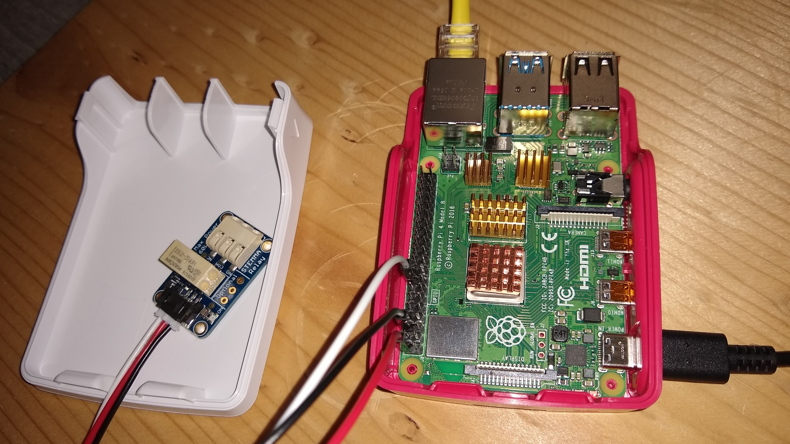

# Simple domotic project using Rust language on Raspberry Pi4-B using an ubuntu 20.04 aarch64

## Goal

I created this project to fix a small problem I have in a remote area.

**The problem**: In this remote area, I have a modem which allows the IoT to communicate some data on internet. Unfortunately the power in this remote area is not really stable, and time to time a micro shutdown of the power happens. If this powerdown is short enough, it leaves the modem in an unknown state and it will never recover from the shutdown.

I can hear some of you saying: "Why don't you put a UPS?". Well that's a good idea, but I was looking at a more versatile solution and a fun project.

**The solution**: I decided to go smarter than just a UPS and look for an "any disconnect event" solution which would prevent internet disconnection from power shutdown but also modem bug and lock state.

I decided to move forward with a Raspberry Pi 4 acting as an internet watchdog and powering off and on the modem by itself if internet is lost.

## Configuration

**The material**:

- [Raspberry Pi 4B/4GB](https://www.digikey.com/product-detail/en/raspberry-pi/RASPBERRY-PI-4B-4GB/1690-RASPBERRYPI4B-4GB-ND/10258781)
- [16GB SD Card](https://www.digikey.com/product-detail/en/panasonic-electronic-components/RP-SMLE16DA1/P17029-ND/5119436)
- [USB-C Power supply](https://www.digikey.com/product-detail/en/raspberry-pi/RPI-USB-C-POWER-SUPPLY-BLACK-US/1690-RPIUSB-CPOWERSUPPLYBLACKUS-ND/10258759)
- [Heat Sink **Do not forget it!**](https://www.digikey.com/product-detail/en/seeed-technology-co-ltd/110991329/1597-110991329-ND/10451888)
- [Micro relay 110V-220V](https://www.digikey.com/product-detail/en/adafruit-industries-llc/4409/1528-4409-ND/10669532)
- [Cable for micro-relay](https://www.digikey.com/product-detail/en/adafruit-industries-llc/3894/1528-2697-ND/9603620)
- [Raspberry Pi 4 case](https://www.digikey.com/product-detail/en/raspberry-pi/RASPBERRY-PI-4-CASE-RED-WHITE/1690-RASPBERRYPI4CASERED-WHITE-ND/10258761)

I give a link to digikey as a reference to the material I bought (the case is optional, I don't know yet how I will mount all that together).

Our bench now:



**The Operating System**:

The Raspberry Pi4 is a 64bits ARM architecture. At this time, ```raspbian``` is limited to 32bits. One of the reason is because Broadcom is not not providing the 64bits version of the video core. But as we are not using the video output of our raspberry, I would say that I do not care about this part. Therefore I decided to move forward with the [Ubuntu 20.04 aarch64 available on the Ubuntu website](https://ubuntu.com/download/raspberry-pi/thank-you?version=20.04&architecture=arm64+raspi).

There is nothing to do, except downloading the image, and following their tutorial to install it on a SD card.

```ssh``` is installed and activated on boot, I did not need any screen on my Raspberry at all.

```uname -a``` on a ```ssh``` session shows us that we are on a 64 bits ARM operating system:
```
ubuntu@ubuntu:~$ uname -a
Linux ubuntu 5.4.0-1008-raspi #8-Ubuntu SMP Wed Apr 8 11:13:06 UTC 2020 aarch64 aarch64 aarch64 GNU/Linux
```
```file /usr/bin/yes``` confirms that binaries are 64bits:
```sh
ubuntu@ubuntu:~$ file /usr/bin/yes
/usr/bin/yes: ELF 64-bit LSB shared object, ARM aarch64, version 1 (SYSV), dynamically linked, interpreter /lib/ld-linux-aarch64.so.1, BuildID[sha1]=953226318f1646263799b28ffc77e0e9e2d88baf, for GNU/Linux 3.7.0, stripped
```

**Set ```gpio``` group and permission**:

We need to add ```gpio``` group to the ubuntu and the permissions to the gpio devices to make our life easier (we could run all our apps but that would not be very serious).

First, add ```gpio``` group and add user ```ubuntu``` to it:
```sh
sudo groupadd -f -r gpio
sudo adduser ubuntu gpio
```
Second, we need to create a ```udev``` rule to set this group to the devices by creating ```/etc/udev/rules.d/99-gpio.rules```:
```sh
ubuntu@ubuntu:~$ cat /etc/udev/rules.d/99-gpio.rules 
SUBSYSTEM=="bcm2835-gpiomem", KERNEL=="gpiomem", GROUP="gpio", MODE="0660"
SUBSYSTEM=="gpio", KERNEL=="gpiochip*", GROUP="gpio", MODE="0660"
SUBSYSTEM=="gpio", KERNEL=="gpiochip*", ACTION=="add", PROGRAM="/bin/sh -c 'chown root:gpio /sys/class/gpio/export /sys/class/gpio/unexport ; chmod 220 /sys/class/gpio/export /sys/class/gpio/unexport'"
SUBSYSTEM=="gpio", KERNEL=="gpio*", ACTION=="add", PROGRAM="/bin/sh -c 'chown root:gpio /sys%p/active_low /sys%p/direction /sys%p/edge /sys%p/value ; chmod 660 /sys%p/active_low /sys%p/direction /sys%p/edge /sys%p/value'"
```

**Activate the firewall**:

Yes, our raspberry will be in the world and need some protection.
> Do not forget to add the ssh authorisation before activating the firewall, otherwise you will loose connection and all possibility to remote-connect!
```sh
sudo ufw allow ssh
sudo ufw enable
```

## Installation and configuration of 'rust' on our development platform

In all my examples, I will use my laptop as development pltaform and send only the binaries to the Raspberry PI (I want my raspberry to be clean, not as a dev platform).

I will use ```rust``` as development language. Why ? Because:

- it is fun to learn a new language
- ```rust``` has an interesting concept of memory management and is very secure
- ```rust``` has low level programation capability
- ```rust``` create a standalone compiled binary
- [finally I let you read all the other reasons there](https://www.rust-lang.org/).

To install it on your laptop folling the installation instruction: [Install Rust](https://www.rust-lang.org/tools/install)

Now we need to add the cross-compilation for ```aarch64```. For linux (Ubuntu to be more precise) you have to install first the compiler tools with this command line (I let you figure out how to install aarch64 compiler on your OS):
```sh
sudo apt install gcc-aarch64-linux-gnu
```

Then you have to install ```rust``` target with the following command line:
```sh
rustup target add aarch64-unknown-linux-gnu
```

And finally you have to tell ```cargo``` what to use for the target in the file ```~/.cargo/config```:

```toml
[target.aarch64-unknown-linux-gnu]
linker = "aarch64-linux-gnu-gcc"
```

> if the file ```~/.cargo/config``` does not exist yet, create it.

This is it. Your development platform is ready.

Lets go for an example, create a ```hello-world``` wherever you want with the following line:

```
cargo new --bin hello-world
```

Move in this project's folder and compile it for aarch64:

```
cd hello-world
cargo build --target aarch64-unknown-linux-gnu
```

Lets verify that the binary is compiled as we want:
```bash
file target/aarch64-unknown-linux-gnu/debug/hello-world
```
output:
```
target/aarch64-unknown-linux-gnu/debug/hello-world: ELF 64-bit LSB shared object, ARM aarch64, version 1 (SYSV), dynamically linked, interpreter /lib/ld-linux-aarch64.so.1, BuildID[sha1]=b67a7f69372f533a85b329095443f4dccb192a81, for GNU/Linux 3.7.0, with debug_info, not stripped
```

Now we have to send this file to our Raspberry with ssh copy:
```
scp target/aarch64-unknown-linux-gnu/debug/hello-world ubuntu@XXX.XXX.XXX.XXX:~
```

And inside a ```ssh``` session on our Raspberry we can execute it:
```bash
ubuntu@ubuntu:~$ ./hello-world 
Hello, world!
ubuntu@ubuntu:~$ 
```

It works!

## Debugging a binary on the Raspberry with our laptop and ```gdb```

To be able to practice remote debugging, we will disable our firewall.
> do not forget to re-enable it when you are done

```bash
ubuntu@ubuntu:~$ sudo ufw disable
```

First we need to install our ```gdbserver``` on our Raspberry:
```bash
ubuntu@ubuntu:~$ sudo apt install gdbserver
```

We can now start the debugging on the Raspberry with the following command:
```bash
ubuntu@ubuntu:~$ gdbserver :2345 ./hello-world 
Process ./hello-world created; pid = 2509
Listening on port 2345
```

Now on the laptop, we need to install ```gdb-multiarch``` because remember that we are cross compiling, and therefore the binary we are going to debug is not an intel x64 format.

On the development machine (my laptop):
```bash
sudo apt install gdb-multiarch
```

We can now launch the debugger from our laptop:
```bash
gdb-multiarch target/aarch64-unknown-linux-gnu/debug/hello-world
```

We are now in the debugger command prompt:
```
GNU gdb (Ubuntu 9.1-0ubuntu1) 9.1
Copyright (C) 2020 Free Software Foundation, Inc.
License GPLv3+: GNU GPL version 3 or later <http://gnu.org/licenses/gpl.html>
This is free software: you are free to change and redistribute it.
There is NO WARRANTY, to the extent permitted by law.
Type "show copying" and "show warranty" for details.
This GDB was configured as "x86_64-linux-gnu".
Type "show configuration" for configuration details.
For bug reporting instructions, please see:
<http://www.gnu.org/software/gdb/bugs/>.
Find the GDB manual and other documentation resources online at:
    <http://www.gnu.org/software/gdb/documentation/>.

For help, type "help".
Type "apropos word" to search for commands related to "word".
(gdb)
```

We add the source folder:
```
(gdb) directory src/
Source directories searched: /home/padonion/hello-world/src:$cdir:$cwd
(gdb) 
```

We then connect to the Raspberry to take the execution there in control:
```
(gdb) target remote 192.168.1.29:2345
Remote debugging using 192.168.1.29:2345
Reading /lib/ld-linux-aarch64.so.1 from remote target...
warning: File transfers from remote targets can be slow. Use "set sysroot" to access files locally instead.
Reading /lib/ld-linux-aarch64.so.1 from remote target...
Reading symbols from target:/lib/ld-linux-aarch64.so.1...
Reading /lib/ld-2.31.so from remote target...
Reading /lib/.debug/ld-2.31.so from remote target...
Reading /usr/lib/debug//lib/ld-2.31.so from remote target...
Reading /usr/lib/debug/lib//ld-2.31.so from remote target...
Reading target:/usr/lib/debug/lib//ld-2.31.so from remote target...
(No debugging symbols found in target:/lib/ld-linux-aarch64.so.1)
0x0000fffff7fcd0c0 in ?? () from target:/lib/ld-linux-aarch64.so.1
(gdb) 
```
And you will see the confirmation on the Raspberry:
```
ubuntu@ubuntu:~$ gdbserver :2345 ./hello-world 
Process ./hello-world created; pid = 2964
Listening on port 2345
Remote debugging from host 192.168.1.20, port 58414
```

**TODO**: add list source file. So far no success.

If I load an x64 binary, I can list the source:

```
hello-world$ gdb-multiarch target/debug/hello-world
GNU gdb (Ubuntu 9.1-0ubuntu1) 9.1
Copyright (C) 2020 Free Software Foundation, Inc.
License GPLv3+: GNU GPL version 3 or later <http://gnu.org/licenses/gpl.html>
This is free software: you are free to change and redistribute it.
There is NO WARRANTY, to the extent permitted by law.
Type "show copying" and "show warranty" for details.
This GDB was configured as "x86_64-linux-gnu".
Type "show configuration" for configuration details.
For bug reporting instructions, please see:
<http://www.gnu.org/software/gdb/bugs/>.
Find the GDB manual and other documentation resources online at:
    <http://www.gnu.org/software/gdb/documentation/>.

For help, type "help".
Type "apropos word" to search for commands related to "word"...
Reading symbols from target/debug/hello-world...
warning: Missing auto-load script at offset 0 in section .debug_gdb_scripts
of file /home/padonion/hello-world/target/debug/hello-world.
Use `info auto-load python-scripts [REGEXP]' to list them.
(gdb) list
1	fn main() {
2	    println!("Hello, world!");
3	}
(gdb) 
```

But if I load an aarch64 binary, I get a Core Dump:
```
hello-world$ gdb-multiarch target/aarch64-unknown-linux-gnu/debug/hello-world
GNU gdb (Ubuntu 9.1-0ubuntu1) 9.1
Copyright (C) 2020 Free Software Foundation, Inc.
License GPLv3+: GNU GPL version 3 or later <http://gnu.org/licenses/gpl.html>
This is free software: you are free to change and redistribute it.
There is NO WARRANTY, to the extent permitted by law.
Type "show copying" and "show warranty" for details.
This GDB was configured as "x86_64-linux-gnu".
Type "show configuration" for configuration details.
For bug reporting instructions, please see:
<http://www.gnu.org/software/gdb/bugs/>.
Find the GDB manual and other documentation resources online at:
    <http://www.gnu.org/software/gdb/documentation/>.

For help, type "help".
Type "apropos word" to search for commands related to "word"...
Reading symbols from target/aarch64-unknown-linux-gnu/debug/hello-world...
warning: Missing auto-load script at offset 0 in section .debug_gdb_scripts
of file /home/padonion/hello-world/target/aarch64-unknown-linux-gnu/debug/hello-world.
Use `info auto-load python-scripts [REGEXP]' to list them.
(gdb) list
Aborted (core dumped)
```
